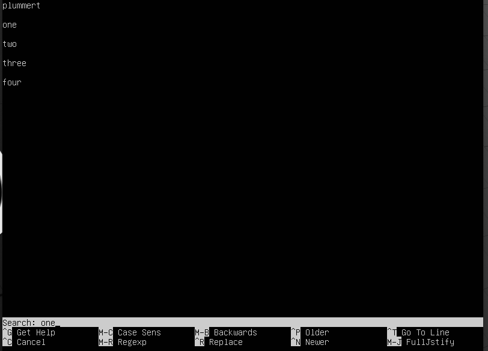

## Part 1. Установка ОС

- Ubuntu Version \

>Ubuntu Version

## Part 2. Создание пользователя

- Добавление пользователя \

- Вывод команды `cat /etc/passwd` \

## Part 3. Настройка сети ОС

- Изменение hostname \

- Изменение timezone \

- Сетевые интерфейсы \

>lo (loopback device) – виртуальный интерфейс, присутствующий по умолчанию в любом Linux. Он используется для отладки сетевых программ и запуска серверных приложений на локальной машине. С этим интерфейсом всегда связан адрес 127.0.0.1. У него есть dns-имя – localhost.

- IP-адрес хоста от DHCP \

>DHCP (Dynamic Host Configuration Protocol) – сетевой протокол, позволяющий сетевым устройствам автоматически получать IP-адрес и другие параметры, необходимые для работы в сети TCP/IP. Данный протокол работает по модели «клиент-сервер». Для автоматической конфигурации компьютер-клиент на этапе конфигурации сетевого устройства обращается к серверу DHCP и получает от него нужные параметры.

- Внешний IP-адрес и адрес шлюза (gw) \

- Статичные настройки ip, gw, dns \
 \
 \

- Проверка сетевых настроек, заданных в предыдущем пункте \

- Ping 1.1.1.1 и ya.ru \

## Part 4. Обновление ОС

- ОС обновлена. Обновления отсутствуют. \

>Команда `sudo apt-get update` обновляет списки пакетов, которые доступны для загрузки в системе. \
>Команда `sudo apt-get upgrade` обновляет установленные пакеты (обновляет ОС).

## Part 5. Использование команды sudo

- Добавление пользователя в группу `sudo` и изменение hostname от его имени. \

>Команда `sudo` предоставляет возможность пользователям выполнять команды `от имени суперпользователя root`.

## Part 6. Установка и настройка службы времени

- Часовой пояс \

- NTP включена \

## Part 7. Установка и использование текстовых редакторов

- Запись никнейма \

>VIM - для выхода с сохранением нажать `ESC` для выхода из режима редактирования. После ввод `:wq!` и `<Enter>`

>NANO - для cохранения нажать `<Ctrl>+O`, для выхода нажать `<Ctrl>+X` или сразу нажать `<Ctrl>+X` и затем подтвердить `<YES>`

>MCEDIT - для cохранения нажать `<F2>`, для выхода нажать `<F10>` или сразу нажать `<F10>` и затем подтвердить `<YES>`

- Изменение содержимого файлов и выход без сохранения \

>VIM - для выхода без сохранения нажать `ESC` для выхода из режима редактирования. После ввод `:q!` и `<Enter>`

>NANO - для выхода без cохранения нажать `<Ctrl>+X` и затем подтвердить `<NO>`

>MCEDIT - для выхода без cохранения нажать `<F2>` и затем подтвердить `<NO>`

- Поиск и замена
>VIM \

>NANO \
 \
>для поиска нажать `<Ctrl>+W`, ввести искомый текст и нажать `<Enter>` \
>для замены нажать `<Ctrl>+\`, ввести искомый текст и нажать `<Enter>`, ввести новый текст и нажать `<Enter>`, выбрать вариант замены

>MCEDIT \
 \
>для поиска нажать `<F7>`, ввести искомый текст и нажать `<Enter>` \
 \
>для замены нажать `<F4>`, ввести искомый и новый текст и нажать `<Enter>`

## Part 8. Установка и базовая настройка сервиса SSHD

- Установка SSH \
`sudo apt-get install openssh-server`

- SSH в автозагрузку \
`sudo systemctl enable sshd`

- Конфигурация SSHD \
`sudo vim /etc/ssh/sshd_config` \

- SSHD в процессах \

> ключ -A - все процессы

- Перезагрузка системы \
`sudo reboot`

- Вывод команды `netstat -tan` \

>`-t` - Отображать TCP подключения\
>`-a` - Показывать состояние всех сокетов; обычно сокеты, используемые серверными процессами, не показываются. \
>`-n` - Показывать сетевые адреса как числа. netstat обычно показывает адреса как символы. \
>`Proto` - Содержит тип протокола \
>`Recv-Q` - Счётчик байтов не скопированных программой пользователя из этого сокета. \
>`Send-Q` - Счётчик байтов, не подтверждённых удалённым узлом. \
>`Local Address` - Адрес и номер порта локального конца сокета. \
>`Foreign Address` - Адрес и номер порта удалённого конца сокета. \
>`State` - Состояние сокета. \
>`LISTEN` - Сокет ожидает входящих подключений. \
>`0.0.0.0` - это немаршрутизируемый адрес IPv4, который используется в качестве адреса по умолчанию или адреса-заполнителя (localhost).

## Part 9. Установка и использование утилит top, htop

### вывод команды top

- uptime, количество авторизованных пользователей, общая загрузка системы, общее количество процессов, загрузку cpu, загрузку памяти \
>команда `top` \

> перевод в цветной режим - клавиша `<z>` \
> подсветка столбца сортироваки - клавиша `<x>` \
> переход по столбцам для изменения сортировки - клавиши `<Shift> + <` или `<Shift> + >` 

- pid процесса занимающего больше всего памяти \

- pid процесса, занимающего больше всего процессорного времени \

### вывод команды htop

- сортировка по PID \

- сортировка по PERCENT_CPU \

- сортировка по PERCENT_MEM \

- сортировка по TIME \

- отфильтрованному для процесса sshd \

- с процессом syslog, найденным, используя поиск \

- с добавленным выводом hostname, clock и uptime
>настройка через Setup `<F2>` \

## Part 10. Использование утилиты fdisk

- Запуск команды fdisk -l.
>команда `sudo fdisk -l` \

> Название жесткого диска - /dev/sda \
> Размер жесткого диска - 25 Gb \
> Количество секторов - 52428800

**Раздел swap физически не размечен на жестком диске, но мы можем посмотреть размер программного swap несколькими способами (см.ниже)**
- swap - 2.2 Gb \

## Part 11. Использование утилиты df

- Запуск команды `df` \

> размер раздела - 11758760 Kb \
> размер занятого пространства - 5198300 Kb \
> размер свободного пространства - 5941352 Kb \
> процент использования - 47% 

- Запуск команды `df -Th` \

> размер раздела - 12 Gb \
> размер занятого пространства - 5.0 Gb \
> размер свободного пространства - 5.7 Gb \
> процент использования - 47% \
> тип файловой системы - ext4

## Part 12. Использование утилиты du

- Запуск команды `du` \

- Размер папок /home \

- Размер папок /var \

- Размер папок /var/log \

- Размер всего содержимого в /var/log, используя * ***(показывает файлы)*** \

## Part 13. Установка и использование утилиты ncdu

- Установка утилиты ***ncdu***. \

- Размер папок /home
> `ncdu -x /home` \

- Размер папок /var
> `ncdu -x /var` \

- Размер папок /var/log
> `ncdu -x /var/log` \

## Part 14. Работа с системными журналами

- Просмотр /var/log/dmesg *(с возможностью прокрутки)*
> `less /var/log/dmesg` \

- Просмотр /var/log/syslog *(с возможностью прокрутки)*
> `less /var/log/syslog` \

- Просмотр /var/log/auth.log *(с возможностью прокрутки)*
> `less /var/log/auth.log` \

- время последней успешной авторизации, имя пользователя и метод входа в систему
> `grep -i login /var/log/auth.log` \
 \
> время последней успешной авторизации - 13:14:30 \
> имя пользователя - plummert \
> метод входа в систему - локально

- Перезапук службу SSHd
> `sudo systemctl restart ssh`

- скрин с сообщением о рестарте службы \

## Part 15. Использование планировщика заданий CRON

### Запуск команды uptime через каждые 2 минуты, используя планировщик заданий

- Настройка задания
> `crontab -e` \

- Строчки в системных журналах о выполнении.
> `tail /var/log/syslog` \
> Для отслеживания появления новых записей использвовать `tail -f /var/log/syslog`

- Список текущих заданий для CRON
> `crontab -l` \

### Удаление всех заданий из планировщика CRON.

- Удаление всех заданий для CRON
> `crontab -r`

- Список текущих заданий для CRON
> `crontab -l` \

